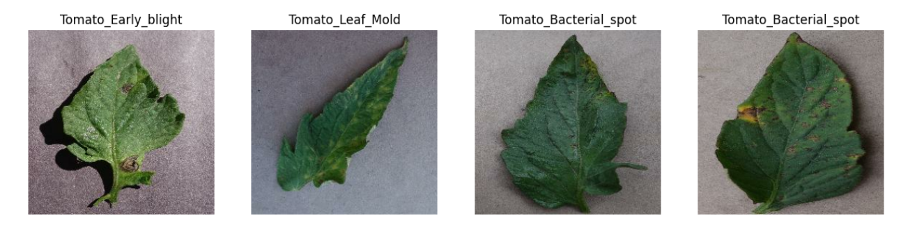

# Problem statement 🍅
A Machine learning approch to detect diseases in tomato leaves.This is to develop an accurate and efficient system that can automatically identify the presence of diseases in tomato leaves from images. The system should be able to classify images into different categories based on the type of disease present and provide recommendations for appropriate treatment measures.It also includes a general fertiliser recommendation system which invokes an ML model and finds out which is the best fit.

# Dataset used 📋
The dataset used for images is the PlantVillage dataset from UPenn and
https://www.kaggle.com/datasets/gdabhishek/fertilizer-prediction/code

# MLsolutionforagriculture 🌾 

This machine learning model is designed to help tomato farmers make informed decisions about disease prevention, fertilizer application, and market trends. It is based on a deep learning architecture that leverages convolutional neural networks (CNNs) to analyze images of leaves and other supervised algorithms to analyze other features.

# Inspiration 💪
Karnataka: Tomato prices crash, ryots allow crops to wither in Kolar 
TOI ,Ranganath Krishnaswamy / TNN / Jul 22, 2022, 09:16 IS .. 
Tomato, onion growers in tears following price crash in Karnataka 
Hindustan Times , PTI | | Posted by Pathi Venkata Thadhagath 
Tomato prices surge as rains damage crop 
By Sutanuka Ghosal, ET BureauLast Updated: Aug 12, 2022, 12:53 AM IST 

Tomato is an integral part of every household throughout India as it is the basic ingredient of almost every dish in the Indian cuisine.
In recent years, the tomato industry in India has faced a significant challenge in the form of tomato leaf diseases, which have caused immense losses for farmers. According to a report by The Economic Times, farmers in Karnataka alone have reported losses of over Rs 500 crore due to diseases in tomato plants.
This inspired me to create a model that provides a solution that can help farmers detect diseases in tomato plants accurately and quickly remedy it.Since we dont have enough crop specific or state specific datasets,this repositary also contains a crop recommendation and fertiliser recommendation system

# What it does ? 🎯
This project aims to revolutionize the way we detect diseases in tomato plants.This project leverages the power of Convolutional Neural Networks (CNNs) to accurately detect diseases in tomato leaves from images.This model simply selects an uploaded image of a tomato leaf and outputs a decently accurate prediction of any disease present.The importance of staying up-to-date on the market trends of tomato production in today's world is crucial.Therefore, this project also includes a visualization of tomato markets in major cities in Karnataka. This feature provides valuable insights into the tomato industry and helps farmers make informed decisions about their crops.Due to the unavailability of a dataset that isolates Karnataka or tomato varieties in fertiliser recommendations the project provides a general fertiliser recommendation system.I hope this project will contribute to the agricultural industry and empower farmers in Karnataka to make informed decisions about their crops.I welcome any feedback and contributions to make this project even better!

# Existing solution and modifications:🛠

It is an Intel oneAPI optimised project hence it provides faster,optimised algorithms and computations.
There are some existing solutions that analyses the image and apply CNN to predict the disease present but this is a modified model that specifically targets the Karnataka farmers and tomato harvesters therefore aims to provides detections specifically catered to them.

# Future Scope :⬆️

<li> If an isolated dataset is found then, the visualisation can be turned into a machine learning model and the fertiliser recommendation system can be more focused on different varieties of tomato.</li>
<li>A GUI can be built and these models can be deployed</li>
<li>If possible the UI could entirely be in kannada so as to make it more accessible to farmers of Karnataka</li>
<li>Similarly if isolated datasets are found for different states it can be applied for the same</li>

# How I built it ?👩‍💻

<li> IMPORT LIBRARIES</li>
<li>IMPORT DATASET</li>
<li>EDA AND LABEL IMAGES</li>

<li>SPLIT THE DATA AND PREPROCESS IT</li>
<li>BUILD A MODEL</li>
<li>TRAIN THE MODEL</li>
<li>ANALYSE THE OUTPUT</li>

# Comparision between InteloneAPI and others💻

Intel OneAPI provides a comprehensive set of tools, libraries, and frameworks that can help optimize code for specific hardware architectures, which can lead to significant improvements in execution times. This level of performance optimization can be particularly valuable for users working on computationally intensive tasks that require high levels of processing power.In context to this project,CNN's prediction happens in seconds unlike in other platforms.Almost all epochs are processed for the whole of training dataset within seconds whereas in other platforms it takes significantly longer time.This was also done without any RAM crashes during the processing.And to whoever uses it,it is clear that Intel OneAPI offers a powerful and versatile set of tools that can help developers and researchers achieve their goals with maximum efficiency and performance.
 

# What did i learn?📊📈
Since I am a beginner in ML, I learnt about a lot of terms,explored a lot of domains and gained a vast array of knowledge,some of it include ...
<li>INTEL ONEAPI AND ITS TOOLKITS : Intel OneAPI is a software development kit that enables developers to create high-performance applications that can run on a variety of hardware platforms, including CPUs, GPUs, and FPGAs. OneAPI offers a set of tools, libraries, and frameworks that developers can use to optimize their code for specific hardware architectures, which can lead to faster and more efficient execution times.</li>
<li>AWARENESS OF ECONOMY : Searching for a problem statement made me aware of the situation,the need for the model and modification required however it also provided me knowledge how these prices vastly affect the economy as a whole.</li>
<li>EDA : From finding the required dataset to exploring it,I gained a lot of knowledge on Data acquisition and preprocessing.</li>
<li>PLANT PATHOLOGY : I likely gained knowledge on different plant diseases and how to remedy it.</li>
<li>MACHINE LEARNING : I likely gained knowledge on CNN and its overall working.</li>
<li>AGRICULTURAL TRENDS: I likely gained insight into current trends in agriculture and the challenges facing farmers, such as the need for sustainable and efficient crop production.</li>
